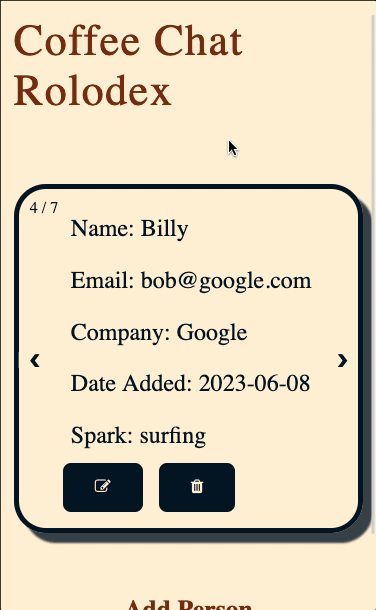

<!-- Improved compatibility of back to top link: See: https://github.com/othneildrew/Best-README-Template/pull/73 -->
<a name="readme-top"></a>
<!--
*** Thanks for checking out the Best-README-Template. If you have a suggestion
*** that would make this better, please fork the repo and create a pull request
*** or simply open an issue with the tag "enhancement".
*** Don't forget to give the project a star!
*** Thanks again! Now go create something AMAZING! :D
-->


<!-- PROJECT SHIELDS -->
<!--
*** I'm using markdown "reference style" links for readability.
*** Reference links are enclosed in brackets [ ] instead of parentheses ( ).
*** See the bottom of this document for the declaration of the reference variables
*** for contributors-url, forks-url, etc. This is an optional, concise syntax you may use.
*** https://www.markdownguide.org/basic-syntax/#reference-style-links
-->
[![Contributors][contributors-shield]][contributors-url]
[![Forks][forks-shield]][forks-url]
[![Stargazers][stars-shield]][stars-url]
[![Issues][issues-shield]][issues-url]


<!-- PROJECT LOGO -->
<br />
<div align="center">
  <a href="https://coffeecontacts.cyclic.cloud/">
    
  </a>

<h3 align="center">Coffee Contacts</h3>

  <p align="center">
    This is a simple app to help engineers save contacts for the folks they have met networking.
    <br />
    <a href="https://github.com/tpritchard843/put-in-the-netWORK"><strong>Explore the docs »</strong></a>
    <br />
    <br />
    <a href="https://coffeecontacts.cyclic.cloud/">View Demo</a>
    ·
    <a href="https://github.com/tpritchard843/put-in-the-netWORK/issues">Report Bug</a>
    ·
    <a href="https://github.com/tpritchard843/put-in-the-netWORK/issues">Request Feature</a>
  </p>
</div>


<!-- TABLE OF CONTENTS -->
<details>
  <summary>Table of Contents</summary>
  <ol>
    <li>
      <a href="#about-the-project">About The Project</a>
      <ul>
        <li><a href="#built-with">Built With</a></li>
      </ul>
    </li>
    <li>
      <a href="#getting-started">Getting Started</a>
      <ul>
        <li><a href="#installation">Installation</a></li>
      </ul>
    </li>
    <li><a href="#roadmap">Roadmap</a></li>
    <li><a href="#lessons-learned">Roadmap</a></li>
  </ol>
</details>


<!-- ABOUT THE PROJECT -->
## About The Project

<a href="https://coffeecontacts.cyclic.cloud/"></img></a>

As engineers, we all know the importance of networking: whether it be for job searches, the exchange of ideas, or just making new friends in the industry.

There are many different ways out there to keep track of contacts for the people you meet. The focus of this app is to concentrate on a specific demoghraphic -- the people you meet when networking.

Coffee Contacts is a one-stop shop for storing contact information for the people you meet. Users can add new contacts, update existing ones, and even delete contacts.

<p align="right">(<a href="#readme-top">back to top</a>)</p>


### Built With

* <a href="https://expressjs.com/"></img></a>
* <a href="https://nodejs.org/"></img></a>
* <a href="https://www.npmjs.com/"></img></a>
* <a href="https://www.mongodb.com/"></img></a>

<p align="right">(<a href="#readme-top">back to top</a>)</p>


<!-- GETTING STARTED -->
## Getting Started

To get a local copy up and running follow these simple example steps.


### Installation

1. Clone the repo
   ```sh
   git clone https://github.com/tpritchard843/put-in-the-netWORK.git
   ```
2. Install NPM packages
   ```sh
   npm install
   ```
3. Update DB_STRING in config/database to connect to your own MongoDB cluster
4. Open a terminal instance in your editor
5. Run the following command and check http://localhost:3001
   ```sh
   npm run dev
   ```

<p align="right">(<a href="#readme-top">back to top</a>)</p>


<!-- ROADMAP -->
## Roadmap

- [X] Add user profiles with sign-up and login features
- [X] Add authorization
- [ ] Implement caching to boost performance
- [ ] Add session storage to DB

See the [open issues](https://github.com/tpritchard843/put-in-the-netWORK/issues) for a full list of proposed features (and known issues).

<p align="right">(<a href="#readme-top">back to top</a>)</p>


## Lessons Learned
* Utilized express routing methods in the server to try and build a modular and scalable backend. Through this we learned how to handle incoming HTTP requests from the client and route them as necessary to our MongoDB database and then respond accordingly with some data.

* We learned how to create and connect to a MongoDB database using the MongoClient. This allows us to store data in JSON-like documents that are easy to handle on the client and the server.

* We also learned about the event loop, and how to utilize promises in our CRUD API to prevent blocking in our application. This creates a better user experience.

<p align="right">(<a href="#readme-top">back to top</a>)</p>


<!-- MARKDOWN LINKS & IMAGES -->
<!-- https://www.markdownguide.org/basic-syntax/#reference-style-links -->
[contributors-shield]: https://img.shields.io/github/contributors/tpritchard843/put-in-the-netWORK.svg?style=for-the-badge
[contributors-url]: https://github.com/tpritchard843/put-in-the-netWORK/graphs/contributors
[forks-shield]: https://img.shields.io/github/forks/tpritchard843/put-in-the-netWORK.svg?style=for-the-badge
[forks-url]: https://github.com/tpritchard843/put-in-the-netWORK/network/members
[stars-shield]: https://img.shields.io/github/stars/tpritchard843/put-in-the-netWORK.svg?style=for-the-badge
[stars-url]: https://github.com/tpritchard843/put-in-the-netWORK/stargazers
[issues-shield]: https://img.shields.io/github/issues/tpritchard843/put-in-the-netWORK.svg?style=for-the-badge
[issues-url]: https://github.com/tpritchard843/put-in-the-netWORK/issues
[license-shield]: https://img.shields.io/github/license/tpritchard843/put-in-the-netWORK.svg?style=for-the-badge
[license-url]: https://github.com/tpritchard843/put-in-the-netWORK/blob/master/LICENSE.txt
[linkedin-shield]: https://img.shields.io/badge/-LinkedIn-black.svg?style=for-the-badge&logo=linkedin&colorB=555
[linkedin-url]: https://linkedin.com/in/linkedin_username
[product-screenshot]: images/rolodexgif.gif
[Node]: https://github.com/get-icon/geticon/raw/master/icons/nodejs-icon.svg
[Node-url]: https://nodejs.org/
[Express]: https://github.com/get-icon/geticon/raw/master/icons/express.svg
[Express-url]:https://expressjs.com/
[NPM]: https://github.com/get-icon/geticon/raw/master/icons/npm.svg
[NPM-url]: https://www.npmjs.com/
[MongoDB]: https://github.com/get-icon/geticon/raw/master/icons/mongodb.svg
[MongoDB-url]: https://www.mongodb.com/
